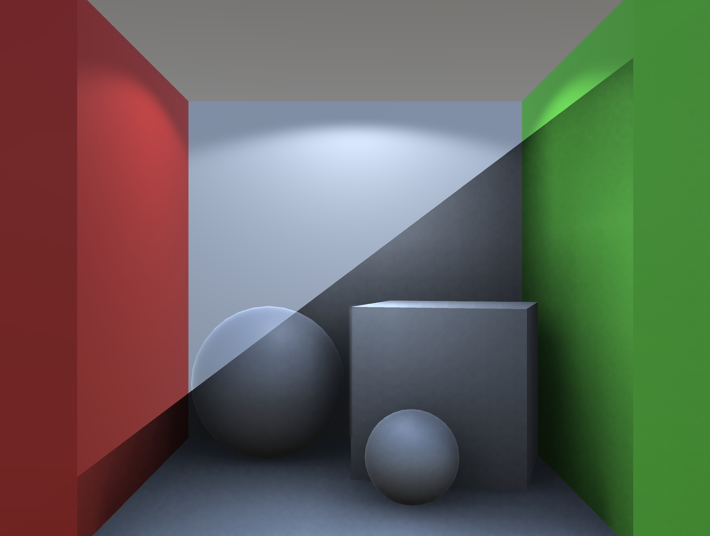

# unity-ssrtao

Screenspace Raytraced Ambient Occlusion post-processing effect for Unity3D.

## Note

This is project IS NOT production ready. 

It's just an experiment I did back in 2018 to try how well **Temporal Reprojection** works for cleaning **Blue Noise** hemisphere samples for **Ambient Occlusion**.

## License

The code is available under the [MIT license](LICENSE)
